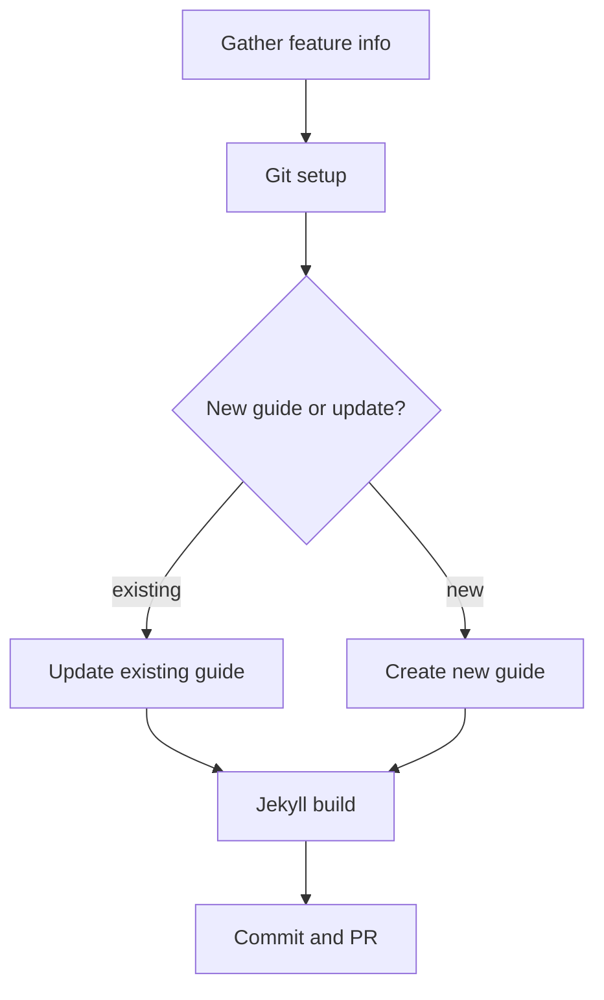

# Documentation Site Updates

## Overview

Update the MultiCloudJ documentation site (Jekyll, `site` branch) by adding new guides or updating existing ones to reflect implemented features.

## When to Use

- User says to update docs/guides after a feature merge
- User provides PR links and asks to document the changes
- User wants to create a new service guide
- User wants to batch-document multiple features

## Workflow



## Step 1: Gather Feature Info

Determine what needs documenting:

- If user provides PR links: use `gh pr view <number>` to read the PR description and changed files
- If user points to code: explore the relevant module interfaces and implementations
- Identify affected service(s): blob, docstore, pubsub, sts, etc.
- Identify affected providers: AWS, GCP, ALI
- Determine if this updates an existing guide or requires a new one

## Step 2: Git Setup

```bash
# Fetch upstream and sync site branch
git fetch upstream site
git checkout site
git reset --hard upstream/site

# Create feature branch
git checkout -b docs/<descriptive-name>
```

## Step 3a: Update Existing Guide

Guides live in `guides/` on the site branch. Find the relevant file:

| Service | File |
|---------|------|
| Blob Storage | `guides/blobstore-guide.md` |
| Document Store | `guides/docstore-guide.md` |
| STS | `guides/sts-guide.md` |
| PubSub | `guides/pubsub-guide.md` |
| IAM | `guides/iam-guide.md` |
| DB Backup/Restore | `guides/dbbackuprestore-guide.md` |
| Container Registry | `guides/registry-guide.md` |

**Updating feature tables:**

- Change roadmap/planned items to `✅ Supported` when implemented
- Add new feature rows to the appropriate table category
- Valid status values: `✅ Supported`, `⏱️ <timeline>` (planned), `📅 In Roadmap`
- Columns are always: Feature Name | GCP | AWS | ALI | Comments

**Adding code examples:**

- Show cloud-agnostic usage via the client API
- Keep examples concise and runnable

## Step 3b: Create New Guide

Use this frontmatter template:

```yaml
---
layout: default
title: How to <Service Name>
nav_order: <next available number>
parent: Usage Guides
---
```

**Required sections in order:**

1. **Title + intro** — one paragraph explaining what the service client does
2. **Feature Support tables** — organized by category (Core, Advanced, Configuration), with columns: Feature Name | GCP | AWS | ALI | Comments
3. **Code examples** — show builder pattern, common operations
4. **Configuration options** — endpoint override, proxy, credentials

Reference `guides/blobstore-guide.md` on the site branch as the canonical template.

## Step 4: Jekyll Build

Generate the HTML from the updated markdown sources. Requires Ruby 3.3 and Bundler.

```bash
export PATH="/opt/homebrew/opt/ruby@3.3/bin:$PATH"
bundle install --quiet
bundle exec jekyll build --destination docs
```

This regenerates the static site in `docs/`. The generated HTML must be committed alongside the markdown sources.

## Step 5: Commit and PR

```bash
git add guides/<file>.md docs/
git commit -m "docs: <description of what was documented>"
git push origin docs/<descriptive-name>
gh pr create --base site --title "docs: <short title>" --body "$(cat <<'EOF'
## Summary
- <what was added/updated>

## Checklist
- [ ] Feature tables accurate
- [ ] Code examples compile
- [ ] Nav order correct
EOF
)"
```

## Common Mistakes

- Forgetting to sync `site` from upstream before branching (causes merge conflicts)
- Using wrong `nav_order` (check existing guides for current numbering)
- PR targeting `main` instead of `site`
- Adding provider-specific jargon in the guide (keep cloud-agnostic tone)
