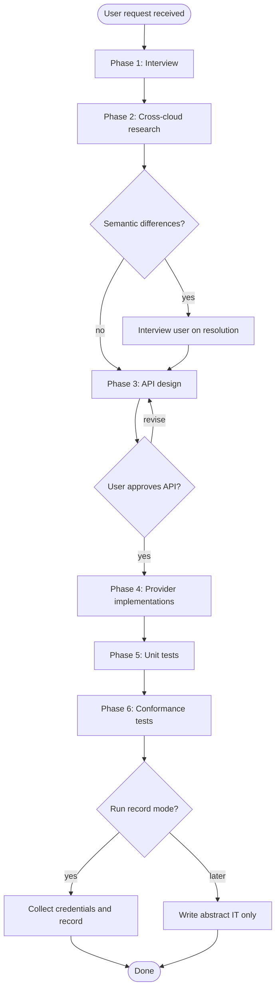

# MultiCloudJ End-to-End Feature Development

## Overview

Implements a new feature across the multicloudj SDK through structured phases: requirements gathering via user interview, cross-cloud research for semantic uniformity, client/driver API design, provider implementations, unit tests, and conformance tests with WireMock record/replay.

## When to Use

- Adding a new operation or capability to an existing service (blob, docstore, pubsub, sts)
- Adding a new service module end-to-end
- User says "add feature", "implement X operation", "support Y across providers"

## When NOT to Use

- Bug fixes to existing implementations (use systematic-debugging)
- Refactoring without behavior change
- Documentation-only changes (use docs-guides)

## Process Flow



## Phase 1: User Interview

Gather requirements before any code. Ask the user:

1. **What service?** (blob, docstore, pubsub, sts, or new)
2. **What operation?** (e.g., "object versioning", "batch delete with filters", "topic dead-letter queue")
3. **What's the user-facing behavior?** (what should the end-user SDK call look like?)
4. **Which providers?** (AWS/GCP/Ali - default is all three)
5. **Are there known provider differences?** (the user may already know gotchas)
6. **Any constraints?** (backwards compatibility, performance, specific SDK versions)

Do NOT proceed until you have clear answers to at least questions 1-3.

## Phase 2: Cross-Cloud Research

Research how each cloud provider implements this feature natively. For each provider (AWS, GCP, Alibaba):

1. **Read the cloud SDK documentation** - understand the native API surface
2. **Identify the SDK classes/methods** that implement this feature
3. **Note semantic differences** between providers:
   - Different parameter names or types
   - Different behavior for edge cases (nulls, empty lists, limits)
   - Features supported by some providers but not others
   - Different error codes/conditions for the same failure

**Present findings to user as a comparison table:**

| Aspect | AWS | GCP | Alibaba |
|--------|-----|-----|---------|
| API method | `s3.putObjectRetention()` | `storage.objects().update()` | `oss.setBucketLifecycle()` |
| Supports X | Yes | Partial | No |
| Error on Y | 403 | 404 | 400 |

### Resolving Semantic Differences

If providers differ, present the user with options:

- **Option A: Lowest common denominator** - only expose what all providers support
- **Option B: Best-effort with capability flags** - expose all, throw `UnsupportedOperationException` where unavailable
- **Option C: Semantic translation** - map different provider behaviors to a unified model

Interview the user on which approach to take. The goal is **semantic uniformity for the end user** - they should not need to know which cloud they're running on.

## Phase 3: API Design

Design the cloud-agnostic API. This involves changes to the `-client` module:

### 3a. Request/Response Objects

Create in the client module's appropriate package:

```
{service}/{service}-client/src/main/java/com/salesforce/multicloudj/{service}/driver/
```

Follow existing patterns:
- Request objects use Builder pattern with `Builder` inner class
- Response objects are immutable with getters
- Use `@Getter` from Lombok where the module already uses it

### 3b. Abstract Driver Method

Add the abstract `do*` method to the abstract class (e.g., `AbstractBlobStore`):

```java
protected abstract {ResponseType} do{OperationName}({RequestType} request);
```

### 3c. Public Client Method

Add the public method to the client class (e.g., `BucketClient`):

```java
public {ResponseType} {operationName}({RequestType} request) {
    return multiCloudJLogger.traceOperation(
        "{operationName}",
        () -> blobStore.{operationName}(request)
    );
}
```

### 3d. Validation

Add validation rules to the validator class (e.g., `BlobStoreValidator`) if inputs need validation.

**Present the API design to the user for approval before implementing providers.**

## Phase 4: Provider Implementations

For each provider (aws, gcp, ali):

### 4a. Implement the `do*` Method

In the provider's main class (e.g., `AwsBlobStore`):

```java
@Override
protected {ResponseType} do{OperationName}({RequestType} request) {
    // 1. Transform multicloudj request → provider SDK request
    // 2. Call provider SDK
    // 3. Transform provider SDK response → multicloudj response
    // 4. Handle provider-specific exceptions via getException()
}
```

### 4b. Add Transformer Methods

In the provider's transformer class (e.g., `AwsTransformer`):
- `to{ProviderRequest}({MulticloudRequest})` - converts outgoing request
- `to{MulticloudResponse}({ProviderResponse})` - converts incoming response

### 4c. Exception Mapping

Update `ErrorCodeMapping` (or equivalent) if the new operation introduces new error conditions.

### 4d. Build and Verify

```bash
mvn clean install -DskipTests
mvn test -pl {service}/{service}-{provider}
```

## Phase 5: Unit Tests

Write unit tests that verify real behavior, not fake coverage.

### What Makes a Real Unit Test

- **Tests behavior, not implementation** - verify the output given an input
- **Mocks the cloud SDK client** (S3Client, Storage, etc.), NOT internal classes
- **Covers error paths** - exception mapping, validation failures, edge cases
- **Tests transformer logic** - correct field mapping between types

### What Is Fake Coverage (DO NOT WRITE)

- Tests that only verify a method was called without checking correctness
- Tests that pass null/empty and assert no exception (unless that's the contract)
- Tests that duplicate the implementation logic in assertions
- Tests with no meaningful assertions

### Run Unit Tests

```bash
mvn clean install -DskipTests
mvn test -pl {service}/{service}-aws -Dtest={TestClassName}
mvn test -pl {service}/{service}-gcp -Dtest={TestClassName}
```

## Phase 6: Conformance Tests

Conformance tests ensure all providers behave identically for the same operation.

### 6a. Abstract Conformance Test

Add test methods to the existing abstract IT class in the client module (e.g., `AbstractBlobStoreIT`):

```
{service}/{service}-client/src/test/java/.../Abstract{Service}StoreIT.java
```

Every conformance test must include both **positive** and **negative** scenarios:

- **Positive scenario**: Happy path — the operation succeeds with valid inputs and the result is correct
- **Negative scenario**: Error path — the operation fails gracefully with invalid inputs (e.g., nonexistent key, invalid parameters) and throws the expected exception

This ensures all providers handle both success and failure consistently.

### 6b. Run in Record Mode (Local with Credentials)

Record mode captures real HTTP interactions with the cloud provider.

**Ask the user for credentials:**

- **AWS:** `AWS_ACCESS_KEY_ID`, `AWS_SECRET_ACCESS_KEY`, `AWS_SESSION_TOKEN`
- **GCP:** `GOOGLE_APPLICATION_CREDENTIALS` (path to service account JSON)
- **Alibaba:** Handled separately on special machines - skip record mode for Ali

**Only run the specific tests impacted by your change** - never record the entire IT suite. This keeps the PR minimal and avoids regenerating unrelated mapping files.

```bash
# AWS record - only the new/changed test method
export AWS_ACCESS_KEY_ID="{from_user}"
export AWS_SECRET_ACCESS_KEY="{from_user}"
export AWS_SESSION_TOKEN="{from_user}"
mvn test -pl {service}/{service}-aws -Dtest="{Provider}{Service}StoreIT#{testMethodName}" -Drecord

# GCP record - only the new/changed test method
export GOOGLE_APPLICATION_CREDENTIALS="{path_from_user}"
mvn test -pl {service}/{service}-gcp -Dtest="{Provider}{Service}StoreIT#{testMethodName}" -Drecord
```

After recording:
- Verify new mapping files appear in `src/test/resources/mappings/`
- Verify no sensitive credentials leaked into mapping files
- **NEVER manually edit or create mapping files** - all mappings must be generated by WireMock recording. If stale files exist from a failed run, delete them and re-record.
- Commit the mapping files (they enable CI replay mode)

### 6c. Run in Replay Mode (CI - Default)

```bash
# No credentials needed - uses recorded WireMock stubs
mvn test -pl {service}/{service}-aws -Dtest="{Provider}{Service}StoreIT#{testMethodName}"
mvn test -pl {service}/{service}-gcp -Dtest="{Provider}{Service}StoreIT#{testMethodName}"
```

### 6d. Alibaba Conformance Tests

Write the abstract conformance test (it runs for all providers). The Ali-specific IT class extends it just like AWS/GCP, but recording happens on dedicated machines. The IT harness class already exists (e.g., `AliBlobStoreIT`) — do not attempt to record locally for Ali.

## File Checklist

For a feature added to an existing service (e.g., blob), you will typically touch:

| Layer | File | Change |
|-------|------|--------|
| Request/Response | `{service}-client/.../driver/{Request}.java` | New file |
| Request/Response | `{service}-client/.../driver/{Response}.java` | New file |
| Abstract driver | `{service}-client/.../driver/Abstract{Store}.java` | Add `do*` method |
| Public API | `{service}-client/.../client/{Client}.java` | Add public method |
| Validator | `{service}-client/.../driver/{Validator}.java` | Add validation (if needed) |
| AWS impl | `{service}-aws/.../Aws{Store}.java` | Implement `do*` |
| AWS transformer | `{service}-aws/.../AwsTransformer.java` | Add conversion methods |
| GCP impl | `{service}-gcp/.../Gcp{Store}.java` | Implement `do*` |
| GCP transformer | `{service}-gcp/.../GcpTransformer.java` | Add conversion methods |
| Ali impl | `{service}-ali/.../Ali{Store}.java` | Implement `do*` |
| Ali transformer | `{service}-ali/.../AliTransformer.java` | Add conversion methods |
| AWS unit test | `{service}-aws/.../{FeatureOrComponent}Test.java` | New or updated |
| GCP unit test | `{service}-gcp/.../{FeatureOrComponent}Test.java` | New or updated |
| Ali unit test | `{service}-ali/.../{FeatureOrComponent}Test.java` | New or updated |
| Conformance test | `{service}-client/.../Abstract{Service}StoreIT.java` | Add test methods |
| AWS IT harness | `{service}-aws/.../Aws{Service}StoreIT.java` | Already exists |
| GCP IT harness | `{service}-gcp/.../Gcp{Service}StoreIT.java` | Already exists |
| Ali IT harness | `{service}-ali/.../Ali{Service}StoreIT.java` | Already exists |
| AWS mappings | `{service}-aws/src/test/resources/mappings/` | Recorded stubs |
| GCP mappings | `{service}-gcp/src/test/resources/mappings/` | Recorded stubs |

## Common Mistakes

- **Adding provider-specific types in client module** - the client module must never import AWS/GCP/Ali SDKs
- **Skipping the user interview** - assumptions about semantics lead to rework
- **Implementing before researching all three clouds** - discovering a provider can't support the feature after implementation is costly
- **Writing conformance tests that are provider-specific** - the abstract IT must work for ALL providers
- **Leaking credentials in WireMock recordings** - always verify mapping files before committing
- **Writing unit tests that only test happy path** - error mapping and edge cases are where bugs hide
- **Not running `mvn clean install -DskipTests` before running individual module tests** - inter-module dependencies need to be built first
- **Manually editing or creating WireMock mapping files** - all mappings must be produced by WireMock recording only. If a recording is stale or corrupt, delete it and re-record.
- **Recording the entire IT suite instead of just the new test** - only run the specific impacted test method in record mode to keep the PR diff minimal

## Red Flags - STOP and Reconsider

- You're implementing a provider without having researched how the other providers handle it
- You're adding a method to the abstract class without a corresponding public client method
- You're writing a conformance test that uses provider-specific setup
- You're importing `software.amazon.awssdk` or `com.google.cloud` in a `-client` module
- You're writing a unit test with no assertions about returned values or thrown exceptions
- You're running record mode without asking the user for credentials first
- You're about to manually edit a WireMock mapping JSON file - STOP: delete and re-record instead
- You're running the full IT class in record mode when only one test method is new/changed - use `#testMethodName` filter
