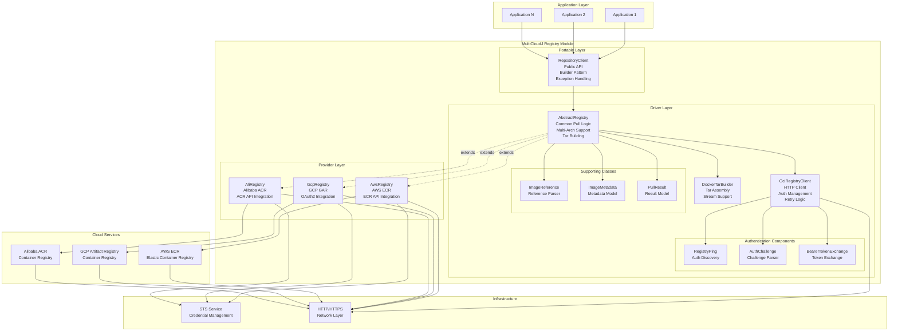
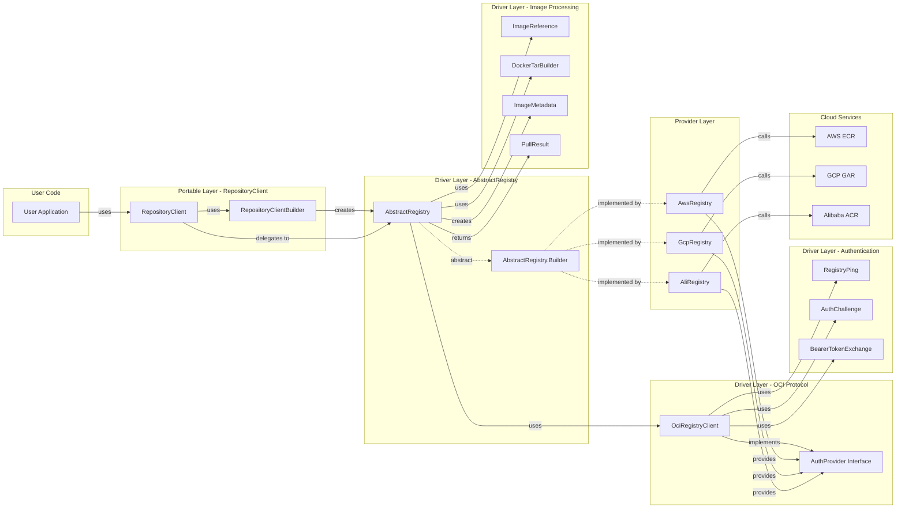
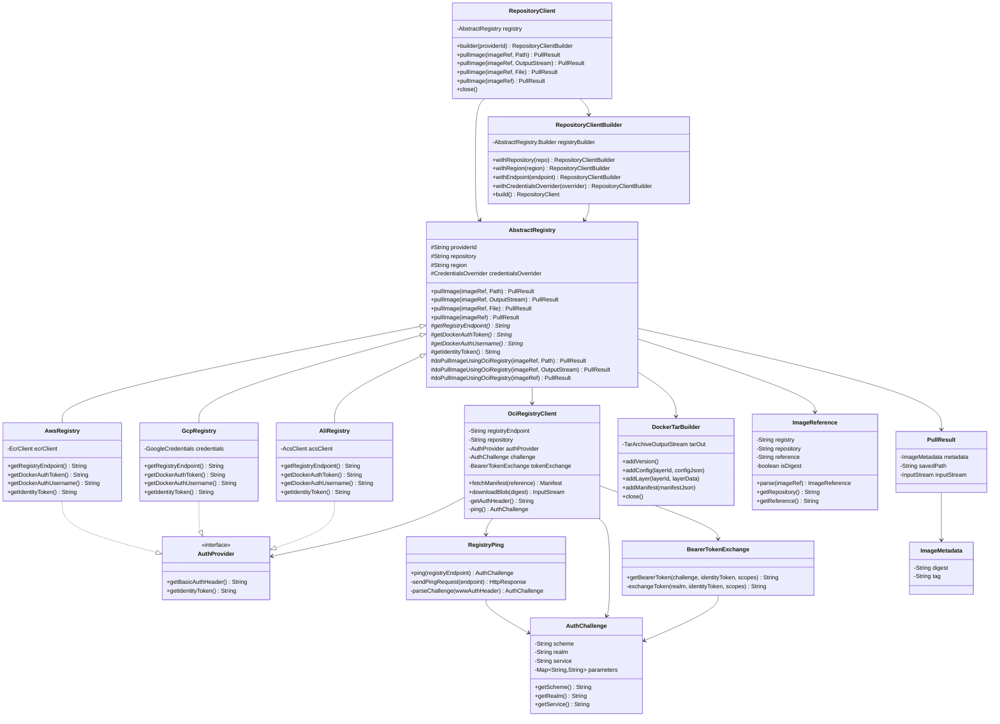
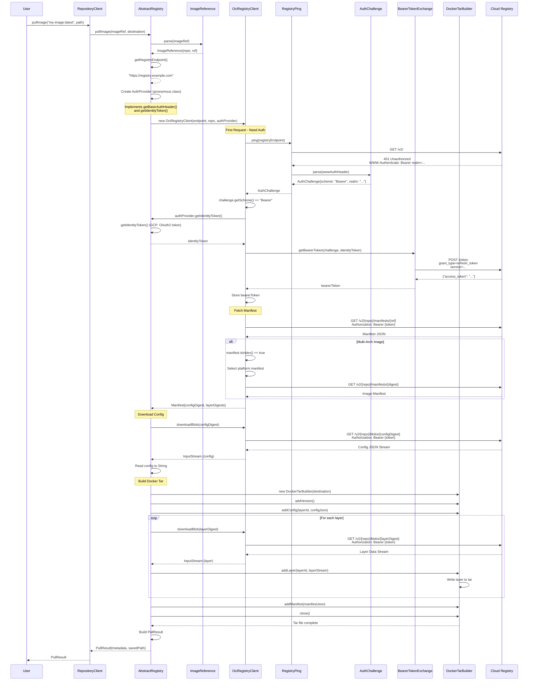
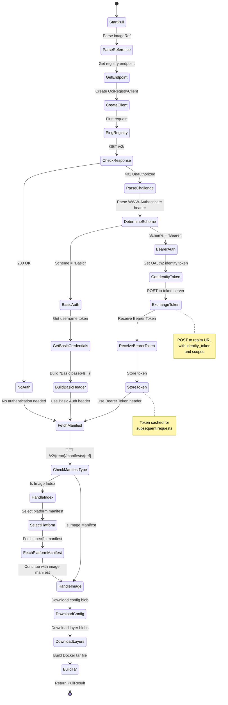
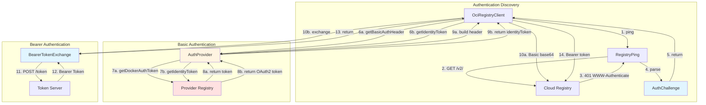
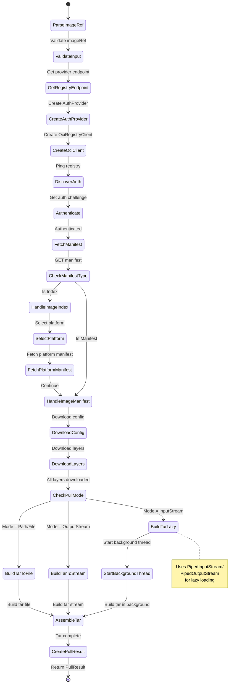
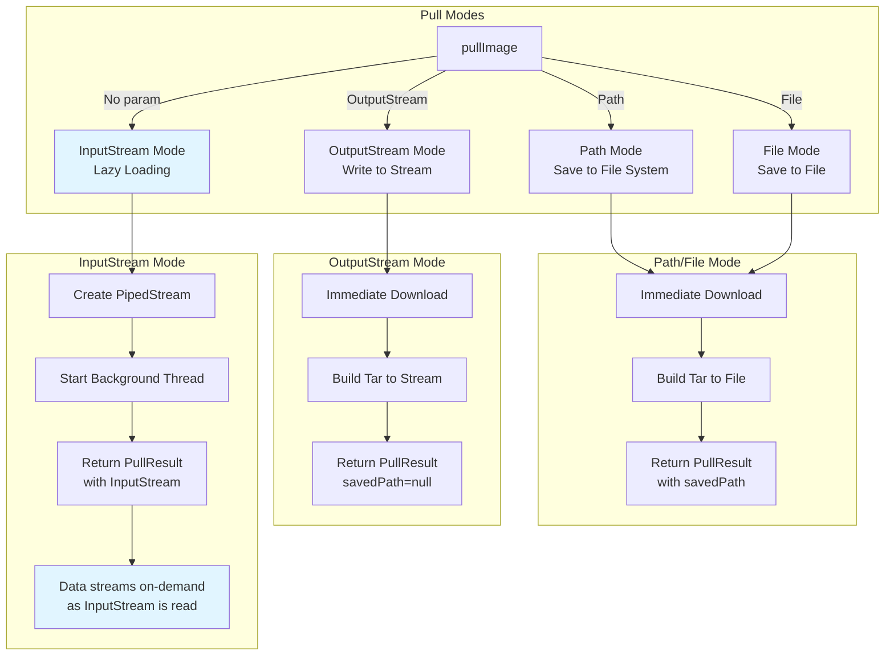
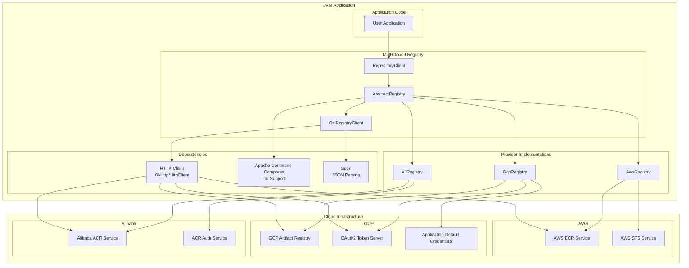
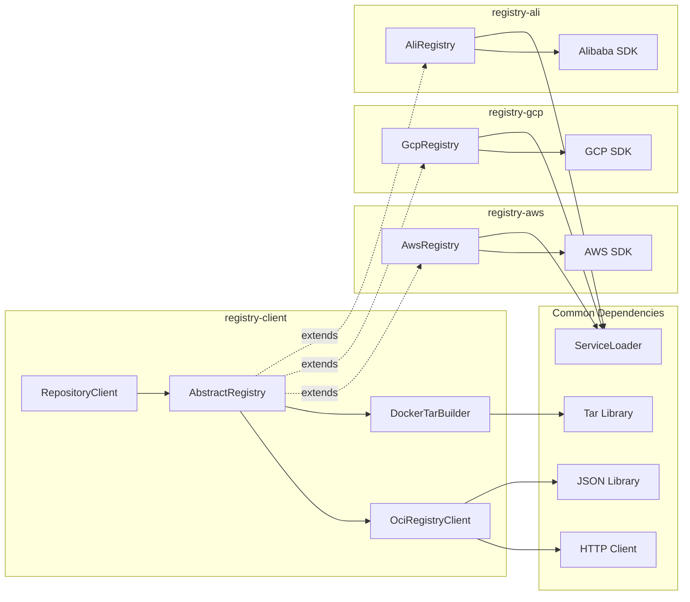

# MultiCloudJ Registry Architecture Diagrams

This document contains detailed architecture diagrams for the MultiCloudJ Registry module.

## Table of Contents
1. [System Architecture Overview](#system-architecture-overview)
2. [Component Architecture](#component-architecture)
3. [Class Diagram](#class-diagram)
4. [Data Flow Diagram](#data-flow-diagram)
5. [Authentication Architecture](#authentication-architecture)
6. [Pull Flow Architecture](#pull-flow-architecture)
7. [Deployment Architecture](#deployment-architecture)

## System Architecture Overview

### High-Level System Architecture

## Component Architecture

### Detailed Component Relationships

## Class Diagram

### Core Classes and Interfaces

## Data Flow Diagram

### Complete Pull Image Data Flow

## Authentication Architecture

### Authentication Flow Diagram

### Authentication Component Interaction

## Pull Flow Architecture

### Pull Image Flow States

### Pull Modes Comparison

## Deployment Architecture

### Runtime Architecture

### Module Dependencies

## Summary

These diagrams illustrate:

1. **System Architecture**: High-level view of all components and their relationships
2. **Component Architecture**: Detailed component interactions
3. **Class Diagram**: Object-oriented design and inheritance hierarchy
4. **Data Flow**: Step-by-step flow of a pull operation
5. **Authentication Architecture**: Dynamic authentication discovery and token exchange
6. **Pull Flow Architecture**: Different pull modes and their execution paths
7. **Deployment Architecture**: Runtime deployment and module dependencies

All diagrams use Mermaid syntax and can be rendered in any Markdown viewer that supports Mermaid (GitHub, GitLab, VS Code, etc.).
