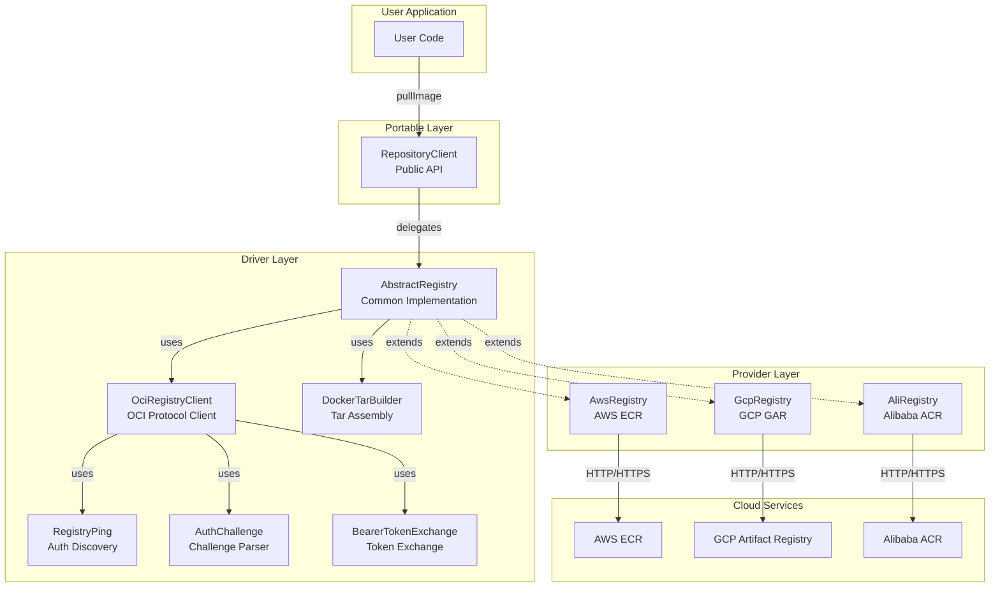
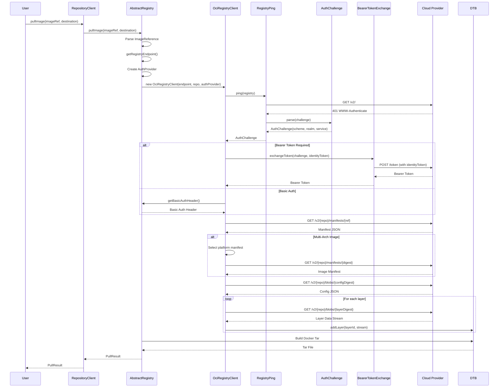
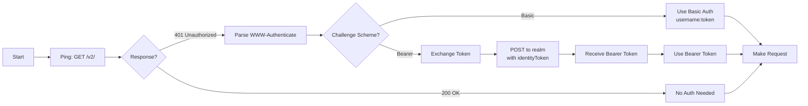
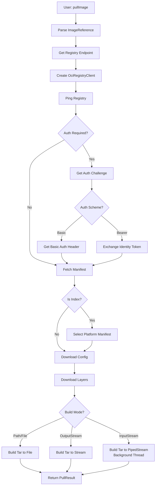

# MultiCloudJ Registry Architecture Design

## Table of Contents
1. [Overview](#overview)
2. [Architecture Diagram](#architecture-diagram)
3. [Design Principles](#design-principles)
4. [Component Design](#component-design)
5. [Authentication Flow](#authentication-flow)
6. [Pull Image Flow](#pull-image-flow)
7. [Comparison with go-containerregistry](#comparison-with-go-containerregistry)
8. [API Design](#api-design)
9. [Implementation Details](#implementation-details)

## Overview

The MultiCloudJ Registry module provides a unified, cloud-agnostic API for pulling Docker/OCI container images from multiple cloud providers (AWS ECR, GCP Artifact Registry, Alibaba ACR). It supports multiple pull modes including lazy loading, similar to go-containerregistry.

### Key Features

- **Unified Pull API**: Single API across AWS ECR, GCP GAR, and Alibaba ACR
- **Multiple Pull Modes**: Support for Path, File, OutputStream, and InputStream (lazy loading)
- **Dynamic Authentication**: Automatic discovery of authentication requirements (Ping + AuthChallenge)
- **Bearer Token Exchange**: Support for OAuth2 token exchange (GCP GAR)
- **Multi-Architecture Support**: Handles multi-arch images (image indexes)
- **Docker Tar Format**: Outputs standard Docker image tar files
- **Streaming Downloads**: Efficient streaming for large images

## Architecture Diagram

### High-Level Architecture



### Component Interaction Flow



## Design Principles

### 1. Layered Architecture

The Registry module follows MultiCloudJ's three-layer architecture pattern:

```
┌─────────────────────────────────────────┐
│   Portable Layer (RepositoryClient)    │  ← User-facing API
│   - Builder pattern                     │
│   - Exception handling                  │
│   - Resource management                 │
├─────────────────────────────────────────┤
│   Driver Layer (AbstractRegistry)      │  ← Common implementation
│   - OCI Registry protocol              │
│   - Authentication flow                 │
│   - Docker tar building                 │
│   - Multi-arch support                  │
├─────────────────────────────────────────┤
│   Provider Layer (AwsRegistry, etc.)  │  ← Cloud-specific logic
│   - Endpoint format                     │
│   - Credential retrieval                │
│   - Exception mapping                   │
└─────────────────────────────────────────┘
```

### 2. Provider Pattern

Each provider implements only **3 abstract methods**:

```java
public abstract class AbstractRegistry {
    // Provider implements these
    protected abstract String getRegistryEndpoint();
    protected abstract String getDockerAuthToken() throws IOException;
    protected abstract String getDockerAuthUsername();
    protected String getIdentityToken() throws IOException;  // Optional (GCP only)
    
    // Common implementation handles everything else
    public PullResult pullImage(String imageRef, Path destination) { ... }
    public PullResult pullImage(String imageRef, OutputStream os) { ... }
    public PullResult pullImage(String imageRef) { ... }  // Lazy loading
}
```

### 3. Multiple Pull Modes

Support for different use cases:

| Mode | Method | Use Case | Lazy Loading |
|------|--------|----------|--------------|
| **Path** | `pullImage(ref, Path)` | Save to file system | ❌ No |
| **File** | `pullImage(ref, File)` | Save to file | ❌ No |
| **OutputStream** | `pullImage(ref, OutputStream)` | Stream to custom destination | ❌ No |
| **InputStream** | `pullImage(ref)` | Lazy loading, on-demand streaming | ✅ Yes |

## Component Design

### RepositoryClient (Portable Layer)

**Purpose**: User-facing API with builder pattern and exception handling.

```java
public class RepositoryClient implements AutoCloseable {
    public static RepositoryClientBuilder builder(String providerId);
    
    // Multiple pull modes
    public PullResult pullImage(String imageRef, Path destination);
    public PullResult pullImage(String imageRef, OutputStream outputStream);
    public PullResult pullImage(String imageRef, File file);
    public PullResult pullImage(String imageRef);  // Lazy loading
}
```

**Responsibilities**:
- Builder pattern for configuration
- Exception mapping and propagation
- Resource management (AutoCloseable)

### AbstractRegistry (Driver Layer)

**Purpose**: Common implementation of pull logic, shared across all providers.

```java
public abstract class AbstractRegistry {
    // Provider-specific (implemented by each provider)
    protected abstract String getRegistryEndpoint();
    protected abstract String getDockerAuthToken() throws IOException;
    protected abstract String getDockerAuthUsername();
    protected String getIdentityToken() throws IOException;  // GCP only
    
    // Common implementation (used by all providers)
    public PullResult pullImage(String imageRef, Path destination);
    public PullResult pullImage(String imageRef, OutputStream os);
    public PullResult pullImage(String imageRef);  // Lazy loading
    
    protected PullResult doPullImageUsingOciRegistry(...);
}
```

**Key Methods**:
- `doPullImageUsingOciRegistry(Path)`: Save to file
- `doPullImageUsingOciRegistry(OutputStream)`: Write to stream
- `doPullImageUsingOciRegistry()`: Return InputStream (lazy loading)

### OciRegistryClient (Driver Layer)

**Purpose**: HTTP client for OCI Registry API v2 operations.

```java
class OciRegistryClient {
    interface AuthProvider {
        String getBasicAuthHeader() throws IOException;
        String getIdentityToken() throws IOException;  // For Bearer Token exchange
    }
    
    Manifest fetchManifest(String reference);
    InputStream downloadBlob(String digest);
}
```

**Features**:
- Automatic authentication discovery (Ping)
- Dynamic auth scheme selection (Basic vs Bearer)
- Bearer Token exchange support
- Automatic token refresh on 401
- Multi-arch image index support

### Authentication Components

#### RegistryPing

**Purpose**: Discover authentication requirements by pinging the registry.

```java
class RegistryPing {
    static AuthChallenge ping(String registryEndpoint) throws IOException;
}
```

**Flow**:
1. Send `GET /v2/` to registry
2. Receive `WWW-Authenticate` header (if 401)
3. Parse challenge into `AuthChallenge` object

#### AuthChallenge

**Purpose**: Parse and represent authentication challenge.

```java
class AuthChallenge {
    String getScheme();      // "Basic" or "Bearer"
    String getRealm();       // Token server URL
    String getService();     // Service identifier
    Map<String, String> getParameters();
}
```

#### BearerTokenExchange

**Purpose**: Exchange identity token for Bearer Token.

```java
class BearerTokenExchange {
    String getBearerToken(AuthChallenge challenge, String identityToken, List<String> scopes);
}
```

**Flow**:
1. Extract `realm` from `AuthChallenge`
2. POST identity token to token server
3. Receive Bearer Token
4. Return token for subsequent requests

### DockerTarBuilder

**Purpose**: Assemble Docker image tar files from components.

```java
class DockerTarBuilder {
    DockerTarBuilder(Path destination);              // File output
    DockerTarBuilder(OutputStream os, boolean gzip); // Stream output
    
    void addVersion();
    void addConfig(String layerId, String configJson);
    void addLayer(String layerId, InputStream layerData);
    void addManifest(String manifestJson);
    void close();
}
```

**Output Format**:
```
image.tar
├── VERSION
├── manifest.json
├── sha256_abc123/
│   ├── json (config)
│   └── layer.tar
└── sha256_def456/
    └── layer.tar
```

## Authentication Flow

### Dynamic Authentication Discovery

The registry client uses a **Ping → Challenge → Exchange** flow to dynamically discover and handle authentication:



### Provider-Specific Authentication

| Provider | Auth Scheme | Token Source | Username | Identity Token |
|----------|------------|-------------|----------|----------------|
| **AWS ECR** | Basic | `ECR.GetAuthorizationToken` API | `"AWS"` | ❌ Not needed |
| **GCP GAR** | Bearer | OAuth2 access token exchange | N/A | ✅ OAuth2 token |
| **Alibaba ACR** | Basic | ACR authorization API | Account name | ❌ Not needed |

### Authentication Code Flow

```java
// In OciRegistryClient
private String getAuthHeader() throws IOException {
    // 1. Ping to discover auth requirements
    if (challenge == null) {
        challenge = RegistryPing.ping(registryEndpoint);
    }
    
    // 2. Select auth scheme
    if (challenge.getScheme().equalsIgnoreCase("Basic")) {
        return authProvider.getBasicAuthHeader();
    }
    
    if (challenge.getScheme().equalsIgnoreCase("Bearer")) {
        // 3. Exchange identity token for Bearer Token
        String identityToken = authProvider.getIdentityToken();
        String bearerToken = tokenExchange.getBearerToken(challenge, identityToken, scopes);
        return "Bearer " + bearerToken;
    }
    
    // Fallback to Basic Auth
    return authProvider.getBasicAuthHeader();
}
```

## Pull Image Flow

### Complete Pull Flow Diagram



### Detailed Pull Steps

1. **Parse Image Reference**
   ```java
   ImageReference ref = ImageReference.parse("my-image:latest");
   // ref.repository = "my-image"
   // ref.reference = "latest"
   ```

2. **Ping Registry** (Authentication Discovery)
   ```java
   AuthChallenge challenge = RegistryPing.ping(registryEndpoint);
   // challenge.scheme = "Bearer"
   // challenge.realm = "https://oauth2.googleapis.com/token"
   ```

3. **Authenticate**
   ```java
   // For Bearer: Exchange identity token
   String bearerToken = BearerTokenExchange.getBearerToken(challenge, identityToken);
   
   // For Basic: Use username:token
   String basicAuth = "Basic " + Base64.encode(username + ":" + token);
   ```

4. **Fetch Manifest**
   ```java
   Manifest manifest = client.fetchManifest("latest");
   // manifest.configDigest = "sha256:abc123..."
   // manifest.layerDigests = ["sha256:def456...", "sha256:ghi789..."]
   ```

5. **Handle Multi-Arch** (if needed)
   ```java
   if (manifest.isIndex()) {
       String selectedDigest = selectPlatform(manifest.getManifests());
       manifest = client.fetchManifest(selectedDigest);
   }
   ```

6. **Download Config**
   ```java
   InputStream configStream = client.downloadBlob(manifest.configDigest);
   String configJson = readToString(configStream);
   ```

7. **Download Layers** (Streaming)
   ```java
   for (String layerDigest : manifest.layerDigests) {
       InputStream layerStream = client.downloadBlob(layerDigest);
       tarBuilder.addLayer(layerId, layerStream);
   }
   ```

8. **Build Docker Tar**
   ```java
   DockerTarBuilder tarBuilder = new DockerTarBuilder(destination);
   tarBuilder.addVersion();
   tarBuilder.addConfig(configId, configJson);
   // ... add layers ...
   tarBuilder.addManifest(manifestJson);
   tarBuilder.close();
   ```

## Comparison with go-containerregistry

### API Signature Comparison

#### go-containerregistry Pull API

```go
// Function signature
func Pull(src string, opt ...Option) (v1.Image, error)

// Input parameters:
//   - src: string - Image reference (e.g., "gcr.io/project/image:tag")
//   - opt: ...Option - Optional configuration (auth, platform, etc.)

// Output:
//   - v1.Image: Structured image object (in-memory, lazy-loaded)
//   - error: Error if pull fails

// Usage:
img, err := crane.Pull("gcr.io/project/image:tag")
// img is a v1.Image object - NOT a tar file
// To save as tar, need separate call:
crane.Save(img, "tag", "image.tar")
```

#### MultiCloudJ Registry Pull API

```java
// Method signatures (multiple overloads)
public PullResult pullImage(String imageRef, Path destination)
public PullResult pullImage(String imageRef, OutputStream outputStream)
public PullResult pullImage(String imageRef, File file)
public PullResult pullImage(String imageRef)  // Lazy loading

// Input parameters:
//   - imageRef: String - Image reference (e.g., "my-image:latest")
//   - destination: Path/File/OutputStream (optional) - Where to save tar file
//   - No destination: Returns InputStream for lazy loading

// Output:
//   - PullResult: Contains metadata + savedPath OR inputStream
//     - metadata: ImageMetadata (digest, tag)
//     - savedPath: String (if saved to file)
//     - inputStream: InputStream (if lazy loading mode)

// Usage:
// Mode 1: Save to file (immediate download)
PullResult result = client.pullImage("my-image:latest", Paths.get("image.tar"));

// Mode 2: Write to stream (immediate download)
PullResult result = client.pullImage("my-image:latest", outputStream);

// Mode 3: Lazy loading (on-demand streaming)
PullResult result = client.pullImage("my-image:latest");
InputStream is = result.getInputStream();  // Data streams on-demand
```

### Detailed API Comparison

| Aspect | go-containerregistry | MultiCloudJ Registry |
|--------|---------------------|---------------------|
| **Function Name** | `Pull` | `pullImage` |
| **Input Parameters** | `src string, opt ...Option` | `imageRef String, destination? (Path/File/OutputStream)` |
| **Output Type** | `v1.Image` (structured object) | `PullResult` (wrapper with metadata + tar) |
| **Return Value** | Image object (in-memory) | Result object (metadata + savedPath/inputStream) |
| **Lazy Loading** | ✅ Yes (per layer) | ✅ Yes (entire tar stream) |
| **Access Components** | ✅ Yes (layers, config, manifest) | ❌ No (only tar stream) |
| **Multiple Modes** | ❌ No (always returns Image) | ✅ Yes (4 modes: Path, File, OutputStream, InputStream) |
| **Tar File** | ❌ No (need `crane.Save()`) | ✅ Yes (built automatically) |
| **Immediate Save** | ❌ No (two-step: Pull + Save) | ✅ Yes (one-step: pullImage with destination) |

### Key Differences

#### 1. Return Type and Purpose

**go-containerregistry:**
- Returns `v1.Image` - A **structured, in-memory object**
- Purpose: Image manipulation (mutate, extract, inspect)
- Components accessible: layers, config, manifest
- Does NOT build tar file automatically

**MultiCloudJ Registry:**
- Returns `PullResult` - A **wrapper with metadata + tar file/stream**
- Purpose: Image download (pull to tar file)
- Components NOT directly accessible (only tar stream)
- Builds tar file automatically

#### 2. Input Parameters

**go-containerregistry:**
```go
Pull(src string, opt ...Option)
// Only needs image reference
// Options for auth, platform, etc.
```

**MultiCloudJ Registry:**
```java
pullImage(String imageRef, Path destination)      // Save to file
pullImage(String imageRef, OutputStream os)      // Write to stream
pullImage(String imageRef, File file)            // Save to file
pullImage(String imageRef)                       // Lazy loading
// Can specify destination directly
```

#### 3. Output Structure

**go-containerregistry:**
```go
type Image interface {
    Layers() ([]Layer, error)
    ConfigFile() (*ConfigFile, error)
    Manifest() (*Manifest, error)
    RawManifest() ([]byte, error)
    // ... more methods
}
// Returns structured object with methods to access components
```

**MultiCloudJ Registry:**
```java
class PullResult {
    ImageMetadata metadata;  // digest, tag
    String savedPath;        // Path to tar file (if saved)
    InputStream inputStream; // Tar stream (if lazy loading)
}
// Returns wrapper with metadata + tar file/stream
```

#### 4. Workflow Comparison

**go-containerregistry Workflow:**
```go
// Step 1: Pull image (returns structured object)
img, err := crane.Pull("my-image:latest")

// Step 2: Access components (if needed)
layers, _ := img.Layers()
config, _ := img.ConfigFile()

// Step 3: Save to tar (separate step)
err = crane.Save(img, "tag", "image.tar")
```

**MultiCloudJ Registry Workflow:**
```java
// Option 1: One-step pull and save
PullResult result = client.pullImage("my-image:latest", Paths.get("image.tar"));
// Tar file is built and saved automatically

// Option 2: Lazy loading (similar to go-cr)
PullResult result = client.pullImage("my-image:latest");
InputStream is = result.getInputStream();  // Data streams on-demand
// Tar file is built in background thread as InputStream is read
```

### Pull Flow Comparison

#### go-containerregistry

```go
// Returns structured v1.Image object
img, err := crane.Pull("my-image:latest")
// img is v1.Image interface - NOT a tar file

// Access components
layers, _ := img.Layers()           // Get layer list
config, _ := img.ConfigFile()       // Get config
manifest, _ := img.Manifest()       // Get manifest

// Each layer is lazy-loaded
layer := layers[0]
reader, _ := layer.Compressed()     // Data still in network stream

// Need explicit save to tar (separate operation)
crane.Save(img, "tag", "image.tar")
```

#### MultiCloudJ Registry

```java
// Mode 1: Save to file (immediate download, one-step)
PullResult result = client.pullImage("my-image:latest", Paths.get("image.tar"));
// Tar file is built and saved automatically

// Mode 2: Write to stream (immediate download)
ByteArrayOutputStream baos = new ByteArrayOutputStream();
PullResult result = client.pullImage("my-image:latest", baos);
// Tar file is built and written to stream

// Mode 3: Lazy loading (on-demand streaming, similar to go-cr)
PullResult result = client.pullImage("my-image:latest");
InputStream is = result.getInputStream();  // Data still in network stream
// Tar file is built in background thread as InputStream is read
```

### Design Philosophy

| Aspect | go-containerregistry | MultiCloudJ Registry |
|--------|---------------------|---------------------|
| **Primary Use Case** | Image manipulation (mutate, extract, etc.) | Image download (pull to tar) |
| **Flexibility** | High (structured access) | Medium (tar file focus) |
| **Simplicity** | Medium (need to understand Image interface) | High (direct tar file) |
| **Java Idioms** | N/A (Go library) | ✅ Follows Java patterns |

## API Design

### RepositoryClient API

```java
public class RepositoryClient implements AutoCloseable {
    // Builder
    public static RepositoryClientBuilder builder(String providerId);
    
    // Pull modes
    public PullResult pullImage(String imageRef, Path destination);
    public PullResult pullImage(String imageRef, OutputStream outputStream);
    public PullResult pullImage(String imageRef, File file);
    public PullResult pullImage(String imageRef);  // Lazy loading
    
    // Resource management
    @Override
    public void close() throws Exception;
}
```

### PullResult Model

```java
@Builder
@Getter
public class PullResult {
    private final ImageMetadata metadata;  // digest, tag
    private final String savedPath;        // Path to file (if saved to file)
    private final InputStream inputStream; // Tar stream (if lazy loading)
}

@Builder
@Getter
public class ImageMetadata {
    private final String digest;  // Image digest
    private final String tag;     // Image tag (null if pulled by digest)
}
```

### Usage Examples

#### Example 1: Save to File (Immediate Download)

```java
try (RepositoryClient client = RepositoryClient.builder("aws")
        .withRepository("my-ecr-repo")
        .withRegion("us-east-1")
        .build()) {
    
    PullResult result = client.pullImage(
        "my-image:latest",
        Paths.get("/tmp/image.tar")
    );
    
    System.out.println("Saved to: " + result.getSavedPath());
    System.out.println("Digest: " + result.getMetadata().getDigest());
}
```

#### Example 2: Write to OutputStream (Immediate Download)

```java
ByteArrayOutputStream baos = new ByteArrayOutputStream();
PullResult result = client.pullImage("my-image:latest", baos);

byte[] tarBytes = baos.toByteArray();
// Process tarBytes...
```

#### Example 3: Lazy Loading (On-Demand Streaming)

```java
// Get InputStream (data still in network stream)
PullResult result = client.pullImage("my-image:latest");
InputStream is = result.getInputStream();

// Read on-demand (triggers actual download)
try (is) {
    byte[] buffer = new byte[8192];
    int bytesRead;
    while ((bytesRead = is.read(buffer)) != -1) {
        // Process data as it streams...
        processChunk(buffer, bytesRead);
    }
}
// Data is downloaded only as InputStream is read
```

#### Example 4: Cross-Cloud Pull

```java
// Same API for all providers
RepositoryClient.builder("aws")...   // AWS ECR
RepositoryClient.builder("gcp")...   // GCP GAR
RepositoryClient.builder("ali")...   // Alibaba ACR
```

## Implementation Details

### Lazy Loading Implementation

The lazy loading mode uses `PipedInputStream`/`PipedOutputStream` to stream the tar file on-demand:

```java
protected PullResult doPullImageUsingOciRegistry(String imageRef) throws IOException {
    // Create pipe for streaming
    PipedInputStream pipedInputStream = new PipedInputStream(1024 * 1024);
    PipedOutputStream pipedOutputStream = new PipedOutputStream(pipedInputStream);
    
    // Start background thread to build tar
    Thread writerThread = new Thread(() -> {
        try {
            // Fetch manifest, download layers, build tar
            DockerTarBuilder tarBuilder = new DockerTarBuilder(pipedOutputStream, false);
            // ... build tar ...
            tarBuilder.close();
            pipedOutputStream.close();
        } catch (IOException e) {
            // Handle error
        }
    }, "ImagePull-StreamWriter");
    writerThread.setDaemon(true);
    writerThread.start();
    
    // Return immediately with InputStream
    return PullResult.builder()
        .metadata(metadata)
        .inputStream(pipedInputStream)
        .build();
}
```

**Key Points**:
- Background thread builds tar file
- Data streams on-demand as `InputStream` is read
- No data is downloaded until `InputStream.read()` is called
- Similar to go-containerregistry's lazy loading

### Multi-Architecture Support

```java
// 1. Fetch manifest with Accept header for index
Manifest manifest = client.fetchManifest(reference);

// 2. Check if it's an image index
if (manifest.isIndex()) {
    // 3. Select platform (default: first manifest)
    JsonArray manifests = manifest.getManifests();
    JsonObject firstManifest = manifests.get(0).getAsJsonObject();
    String selectedDigest = firstManifest.getAsJsonObject("digest").getAsString();
    
    // 4. Fetch specific platform manifest
    manifest = client.fetchManifest(selectedDigest);
}

// 5. Continue with regular image manifest
```

**Accept Header**:
```
application/vnd.oci.image.index.v1+json,
application/vnd.docker.distribution.manifest.list.v2+json,
application/vnd.oci.image.manifest.v1+json,
application/vnd.docker.distribution.manifest.v2+json
```

### Error Handling

- **401 Unauthorized**: Automatic retry with fresh auth token
- **404 Not Found**: Throws `ResourceNotFoundException`
- **Network Errors**: Retry with configurable retry policy
- **Provider Exceptions**: Mapped to MultiCloudJ common exceptions

### Performance Optimizations

- **Streaming Downloads**: Layers downloaded as streams, not buffered in memory
- **Single-Pass Processing**: Tar file built in one pass
- **Lazy Loading**: Data downloaded only when needed (InputStream mode)
- **Future**: Parallel layer downloads, layer caching

## Summary

The MultiCloudJ Registry module provides:

✅ **Unified API** across AWS ECR, GCP GAR, and Alibaba ACR  
✅ **Multiple Pull Modes** including lazy loading  
✅ **Dynamic Authentication** with automatic discovery  
✅ **Bearer Token Support** for OAuth2-based registries  
✅ **Multi-Arch Support** for platform-specific images  
✅ **Docker Tar Format** compatible with `docker load`  
✅ **Consistent Design** following MultiCloudJ patterns  

The design balances simplicity with functionality, ensuring developers can easily pull images from any supported cloud provider with a unified, flexible API.
